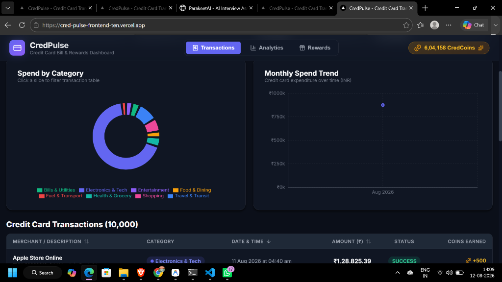
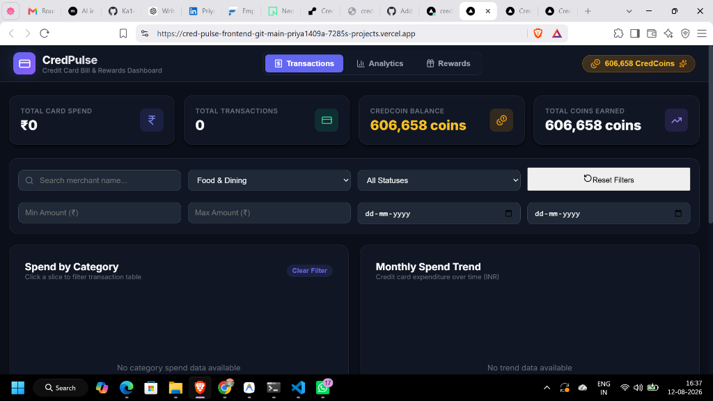

# CredPulse Backend - Python FastAPI & PostgreSQL Engine

## 1. What the Project Does
The CredPulse Backend is a high-performance RESTful API service powering credit card bill payments, transaction search, spend analytics aggregation, and reward coin redemptions. It queries 10,000+ credit card transactions stored in PostgreSQL 17 with sub-15ms response times using indexed query optimization.

---

## 2. Live Demo Link
- **Deployed Backend API (Render)**: [https://credpulse-backend-te5q.onrender.com](https://credpulse-backend-te5q.onrender.com)
- **Backend Swagger API Docs**: [https://credpulse-backend-te5q.onrender.com/docs](https://credpulse-backend-te5q.onrender.com/docs)
- **Deployed Frontend (Vercel)**: [https://cred-pulse-frontend-ten.vercel.app/](https://cred-pulse-frontend-ten.vercel.app/)
- **GitHub Repository**: [https://github.com/Ka1478/CredPulse.git](https://github.com/Ka1478/CredPulse.git)

---

## 3. Tech Stack
- **Framework**: Python 3.10+, FastAPI, Uvicorn
- **ORM / Database Access**: AsyncSQLAlchemy, psycopg2 / asyncpg
- **Validation & Schemas**: Pydantic v2
- **Database Engine**: PostgreSQL 17
- **Testing**: Pytest

---

## 4. Main Features
- [x] **Sub-15ms Transactions API**: Paginated `GET /api/v1/transactions` with combinable filters (`search`, `category_id`, `status`, `min_amount`, `max_amount`, `start_date`, `end_date`, `sort_by`, `sort_order`).
- [x] **Spend Analytics Summary API**: `GET /api/v1/analytics/summary` computing category spend breakdown and 32-month spend trends dynamically.
- [x] **Rewards & Coin Balance API**: `GET /api/v1/rewards` and atomic `POST /api/v1/rewards/redeem` handling optimistic balance deduction and rollback validation.
- [x] **1-Command Database Seeder**: `seed.py` creates PostgreSQL DDL schema, seeds 10,000 transactions, computes reward balances, and exports `transactions.json`.
- [x] **Automated Test Suite**: Pytest tests covering balance validation, insufficient coin error handling (HTTP 400), and voucher redemptions.

---

## 5. Screenshots


*CredPulse Dashboard displaying Spend Analytics, Multi-Criteria Filters, and Transactions Table*


*Two-way synchronized Spend by Category Donut Chart and filtered Transactions Table*

---

## 6. Setup Instructions

### Prerequisites
- Python 3.10+
- PostgreSQL 16 or 17 (Running on `localhost:5432` with superuser `postgres`)

### Local Setup & 1-Command Database Seeding
```bash
# Navigate to backend directory
cd backend

# Create virtual environment
python -m venv venv

# Activate virtual environment
# On Windows:
.\venv\Scripts\activate
# On Linux/macOS:
source venv/bin/activate

# Install dependencies
pip install -r requirements.txt

# Run 1-command database seeder
python seed.py
```

### Start Backend API Server
```bash
python -m uvicorn app.main:app --reload --port 8000
```
FastAPI server will start at `http://127.0.0.1:8000` (API Docs at `http://127.0.0.1:8000/docs`).

### Run Automated Tests
```bash
pytest tests/ -v
```

---

## 7. Project Structure

```text
backend/
├── app/
│   ├── main.py               # FastAPI application entrypoint & CORS middleware
│   ├── config.py             # Settings & database connection URIs
│   ├── db.py                 # Async SQLAlchemy engine & session maker
│   ├── models.py             # SQLAlchemy ORM models (User, Category, Transaction, RewardItem, Redemption)
│   ├── schemas.py            # Pydantic v2 input/output data schemas
│   ├── seed.py               # 1-command database seeder script
│   ├── routers/
│   │   ├── transactions.py   # Transactions listing & category endpoints
│   │   ├── analytics.py      # Analytics summary endpoint
│   │   └── rewards.py        # Rewards list & atomic redemption endpoint
│   └── services/
│       ├── transactions.py   # Transaction filtering & query builder logic
│       └── rewards.py        # Coin balance verification & atomic voucher redemption
├── tests/
│   └── test_rewards.py       # Pytest unit tests for rewards & coin balance validation
├── requirements.txt          # Python dependencies
├── schema.sql                # PostgreSQL DDL table definitions & B-tree indexes
└── README.md
```
